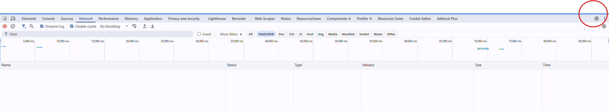
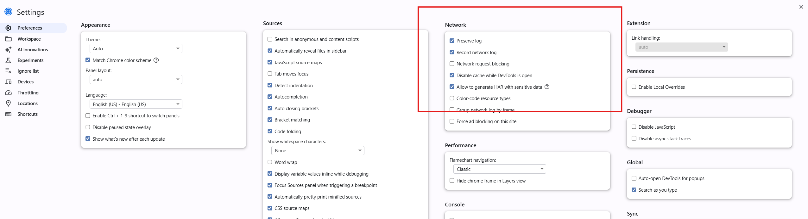
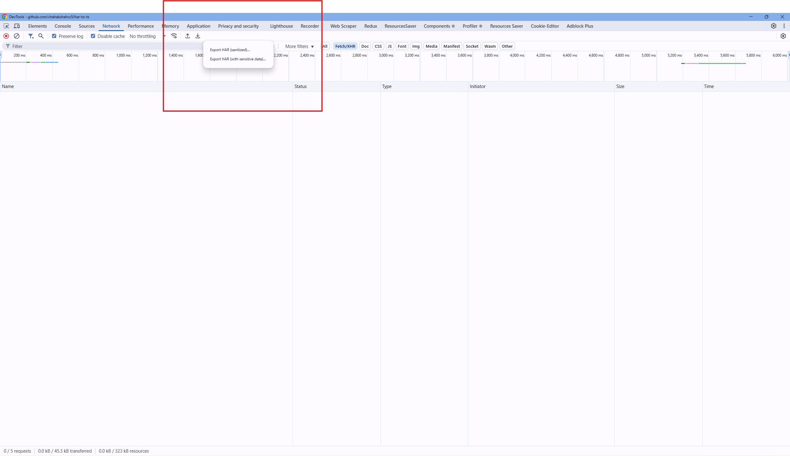

# har-to-ts

A command-line tool to convert HAR (HTTP Archive) files into TypeScript SDKs.

## Installation

```bash
npm install -g .
```

## Usage

```bash
har-to-ts <sourcefile> <destinationfile>
```

### Arguments

- `<sourcefile>`: The path to the source HAR file.
- `<destinationfile>`: The path to the destination TypeScript file.

## Example

```bash
har-to-ts session.har api.ts
```

This will read the HAR file `session.har` and generate the TypeScript SDK in `api.ts`.

## How to get HAR file
-  Open any website for which you want to generate API file
-  Open Developer Tools and Click on Settings
-  
-  
    Check Preserve Log, Record Network Log And Allow to generate HAR with sensitive data
-  Clear Network Log and Refresh Page and surf and explore entire website and then click Download Icon
   


## License

MIT
